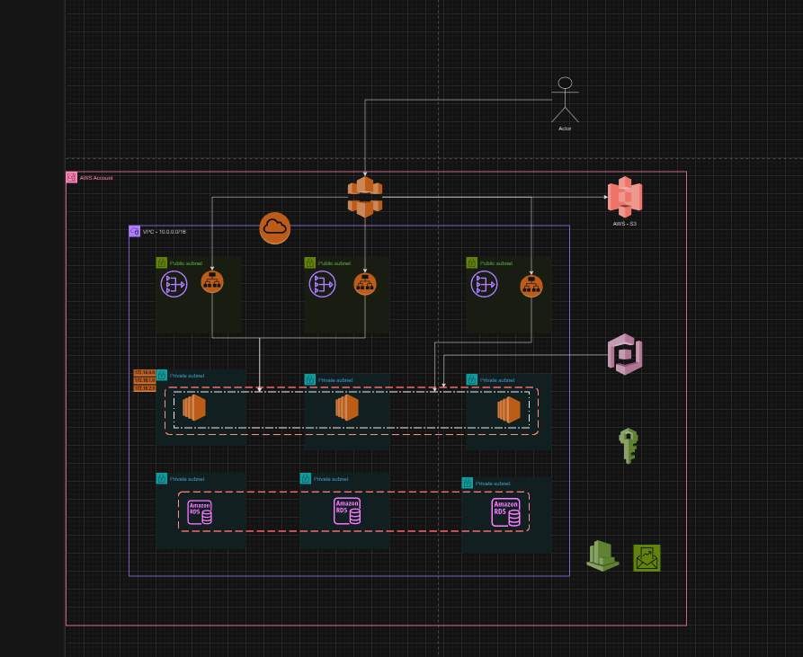

## terraform studies

# Projeto Final ADA Simulando um E-commerce de Produtos Digitais - José Rodrigues

# Descricao

- Imagine que você está revisando a arquitetura de um site de e-commerce que vende produtos digitais, como e-books e cursos online. O sistema é configurado para escalar automaticamente em períodos de alta demanda, como em campanhas de marketing e datas de promoção.

- Arquitetura inicial do projeto
  

# Detalhes da Arquitetura:

- O projeto do e-commerce foi configurado utilizado provedor da AWS realizado em um arquitetura simplificada

1. Front-end:
   - Amazon S3 para armazenar os arquivos estáticos do site.
   - Amazon CloudFront para entrega de conteúdo e CDN.
2. Back-end:
   - Amazon EC2 para hospedar a API que lida com pedidos e login de usuários.
   - Auto Scaling configurado para ajustar a quantidade de instâncias com base na demanda.
3. Banco de Dados:
   - Amazon RDS (MySQL) configurado em uma VPC, em uma única AZ
   - Backups automáticos do banco de dados são feitos diariamente.
4. Armazenamento de Produtos:
   - Amazon S3 para armazenar os arquivos digitais (e-books, cursos).
5. Segurança:
   - AWS IAM gerenciando as permissões para que apenas administradores possam acessar o back-end.
   - Amazon Cognito para autenticação de usuários do front-end.
6. Monitoramento:
   - Amazon CloudWatch monitora o desempenho das instâncias EC2 e envia alarmes para o time técnico.
7. Gerenciamento de Custos:
   - AWS Budgets configurado para alertar se os custos mensais ultrapassarem um limite definido.

# Instruções de Execução

1. Configurar as credenciais da AWS, tais como chave, chave secreta, região e formato de texto, cria um usuário de IAM, para uso na CLI e adicione as permissões necessãrias a seu projeto, após isso, no terminal digite:

```bash
aws configure
```

2. Para checar suas credenciais corretamente:

```bash
aws sts get-caller-identity
```

3. Usando o Terraform (caso não tenha instalado, seguir os passos de instalação no link: [instalação](https://developer.hashicorp.com/terraform/tutorials/aws-get-started/install-cli))

3.1. Usando o Terraform, comando inicializar um repositório:

```bash
terraform init
```

3.2. Realizando o plano do projeto

```bash
terraform plan -out nome_do_plan.tfplan
```

3.3. Aplicando mudanças, sem pedir pela confiramação

```bash
terraform apply -auto-approve
```

3.4. Caso deseje destruir toda infraestrutura, sem pedir pela confirmação

```bash
terraform destroy -auto-approve
```
